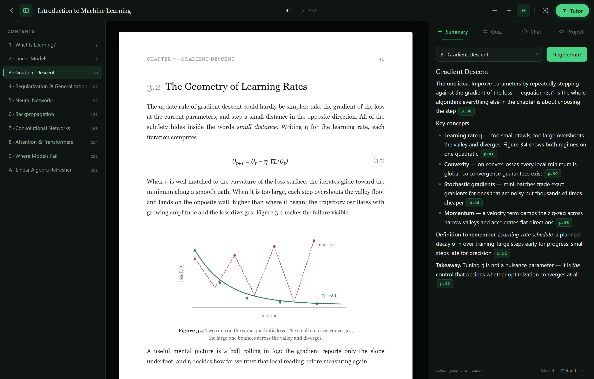
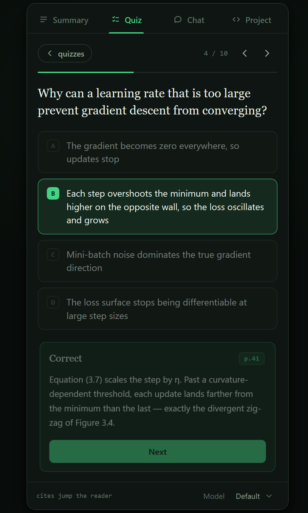
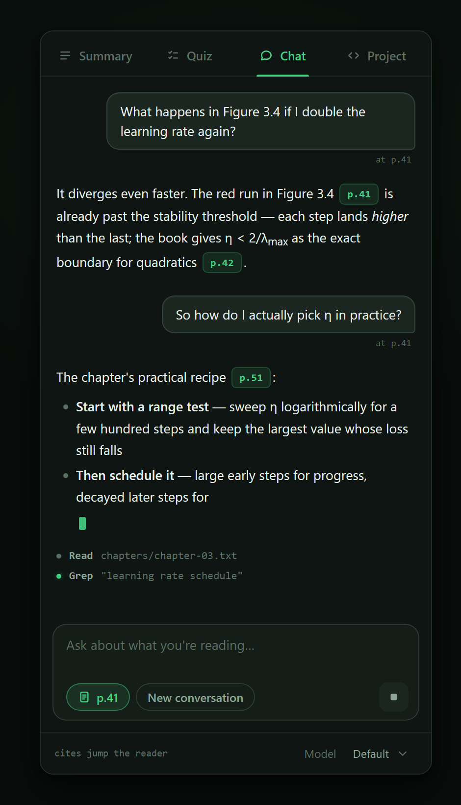

<div align="center">


# TutorAI

**A desktop PDF reader with a tutor inside.**

Open a textbook. Ask it anything. Every answer cites the page.

[](https://tauri.app)
[](https://react.dev)
[](https://www.rust-lang.org)
[](https://mozilla.github.io/pdf.js/)
[](https://claude.com/claude-code)


[Features](#features) · [How it works](#how-it-works) · [Getting started](#getting-started) · [Project layout](#project-layout) · [Troubleshooting](#troubleshooting)

<br/>


<sub><i>Reading with the tutor open — every claim in the summary carries a</i> <code>p.N</code> <i>chip that jumps the reader to the evidence.</i></sub>

</div>

---

TutorAI turns any PDF — a textbook, a paper, a technical report — into something
you can study *with*, not just read. It summarizes chapters, quizzes you on what
you've read, answers questions grounded in the exact page you're looking at, and
can even build a runnable coding project out of the material. Every answer cites
its sources: click a `p.12` chip anywhere and the reader jumps to that page.

All of it runs through the **[Claude Code](https://claude.com/claude-code) CLI
already installed on your machine**. There are no API keys to manage, no
accounts to create, and no backend service: if `claude` works in your terminal,
TutorAI works. Your documents are parsed locally and cached on disk; the only
thing that leaves your machine is what the CLI itself sends when you ask the
tutor something.

---

## Features

### The reader

- **Fast on big books.** Pages render through a virtualized pdf.js viewer —
  only what's near the viewport is rasterized — so thousand-page PDFs scroll
  smoothly.
- **A real library.** Every book gets a rendered cover, a reading-progress bar,
  and a remembered position. Close the app mid-chapter; reopen on the same page.
- **Chapter outline.** The sidebar shows the document's bookmark outline. If a
  PDF has none, one click asks the AI to reconstruct chapters from the text.
- **Precise text selection** with a one-click **Explain** / **Ask** popover on
  whatever you highlight.
- **Snip a figure.** Drag a box around a diagram, chart, or equation right on
  the page and it lands in Chat as an image — the tutor sees exactly what you
  circled, not just the surrounding text.
- Resizable, smoothly sliding panels; an editable page indicator; fit-width and
  manual zoom.

### The tutor

Four tabs live in the study panel, all scoped to either the whole document or a
single chapter:

| Tab | What it does |
| --- | --- |
| **Summary** | Page-cited study summaries — key concepts, definitions, takeaways. |
| **Quiz** | Interactive multiple-choice quizzes (length and difficulty are yours to pick), graded as you go, with explanations and a citation for every question. Progress is saved; skip around freely and resume any time. |
| **Chat** | Ask anything about the document, or snip a figure straight into the conversation. With *reading context* on, the tutor sees the page you're currently on and its neighbors — "why does this equation hold?" just works. The tutor can see figures and diagrams too, not just extracted text. Conversations are multi-turn. |
| **Project** | An agentic Claude builds a runnable coding project from the material into an isolated workspace folder, verifies it runs, and maps the code back to the pages it teaches. |

Citations are everywhere by design: every claim the tutor makes about the
document carries a `p.N` chip that jumps the reader to the evidence.

### The companion

An opt-in fifth presence (the margin-note toggle in the toolbar): while you
read, the companion analyzes the pages you're on in the background and leaves
**margin notes** — quiet green marks beside the page that expand into cards.
It only writes what the document *doesn't* say: real-world examples, gotchas
practitioners actually hit, missing context, and web-verified "the world has
moved on" updates with source links. Most page spans yield nothing — silence
is by design. Every analyzed span is cached in the document's artifacts, so a
span never spends your quota twice; a note can be dismissed or handed to the
chat tab to dig deeper.

<p align="center">
  
  
</p>
<p align="center">
  <sub><i>Left: quizzes grade as you go and cite the page behind every answer. Right: chat streams in live — including which chapter files the tutor is reading.</i></sub>
</p>

---

## How it works

```
┌──────────────────────────────────────────────────────────────┐
│  React + pdf.js (Tauri webview)                              │
│    · virtualized rendering, selection, outline               │
│    · extraction: per-page text with [[PAGE n]] markers +     │
│      figure pages rendered to JPEG; chapters from the        │
│      outline (or AI-reconstructed)                           │
│    · cached under <app-data>/docs/<content-hash>/            │
└───────────────┬──────────────────────────────────────────────┘
                │ Tauri IPC (typed commands, streamed events)
┌───────────────▼──────────────────────────────────────────────┐
│  Rust (Tauri)                                                │
│    · spawns `claude -p --output-format=stream-json` per job  │
│    · streams NDJSON events (text deltas, tool activity)      │
│      back to the UI; `--resume` powers multi-turn chat       │
│    · document jobs run read-only over the cached chapter     │
│      files; project jobs run agentic, cwd-pinned to an       │
│      isolated workspace folder                               │
└──────────────────────────────────────────────────────────────┘
```

A few properties fall out of this design:

- **No API keys, ever.** The Claude CLI handles authentication; TutorAI never
  sees or stores a credential.
- **Extraction happens once.** On first open, the document's text is extracted
  per page and split into chapter files keyed by the file's content hash.
  Every AI feature reads from that cache instead of re-parsing the PDF.
- **Least privilege per job.** Summaries, quizzes, and chat run with read-only
  file access to the document cache. Only project generation gets write access,
  and only inside its own workspace directory.
- **Everything streams.** Long jobs show live progress — including which files
  the agent is reading — and can be cancelled mid-flight.

---

## Getting started

### Requirements

- **[Claude Code](https://claude.com/claude-code)** installed and signed in
  (`claude` must be on your `PATH`)
- **Node.js** 20+ and **Rust** (stable) — standard
  [Tauri 2 prerequisites](https://tauri.app/start/prerequisites/) for your OS
- Windows, macOS, or Linux with WebView2/WebKit

### Run it

```sh
npm install
npm run tauri dev      # develop, with hot reload
npm run tauri build    # produce a signed installer / bundle
```

Open a PDF via the button or just drop one anywhere onto the window.

---

## Project layout

```
src/                      React frontend
  lib/                    types, IPC wrappers, pdf.js extraction,
                          prompt builders, session state
  components/             Reader, Home/library, toolbar, and the
                          Summary / Quiz / Chat / Project tabs
src-tauri/src/
  claude.rs               headless CLI runner: spawn, NDJSON→event
                          translation, cancellation
  jobs.rs                 in-flight job registry
  store.rs                library index + per-document cache on disk
scripts/
  render-icon.mjs         rasterizes the SVG app-icon design source
                          (regenerate everything with `npm run icon`)
```

### Design

The UI is a single dark theme ("night study"): a green-cast ink palette around
a near-black page well, with one spring-green accent reserved for AI presence
and the places it can take you. Type is set in three voices — Newsreader for
the reading world, Inter for controls, JetBrains Mono for the instrument layer
(page numbers, citations, activity). The app icon is the **Bookmark-T** — a
"T" for Tutor whose stem is a ribbon bookmark — and the same glyph marks AI
presence throughout the interface. Its design source lives at
`src-tauri/icons/icon.svg`; after editing it, run `npm run icon` and touch
`src-tauri/build.rs` so the next build re-embeds the Windows icon resource.

---

## Troubleshooting

- **"claude not found" / jobs fail instantly** — make sure `claude` runs in a
  fresh terminal. TutorAI inherits your login environment; if the CLI was just
  installed, restart the app.
- **A PDF opens but AI tabs stay on "Preparing"** — extraction of very large
  documents takes a moment on first open (progress is shown bottom-center of
  the reader). It only happens once per document.
- **Chapters look wrong** — PDFs without a bookmark outline fall back to a
  single whole-document chapter; use *Detect chapters with AI* in the sidebar.
