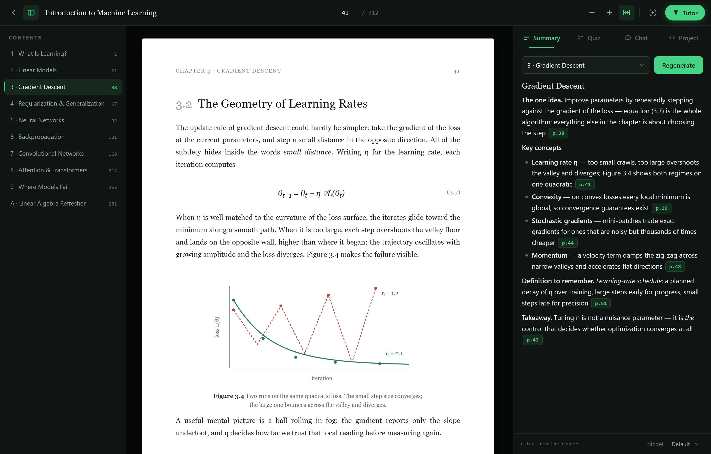
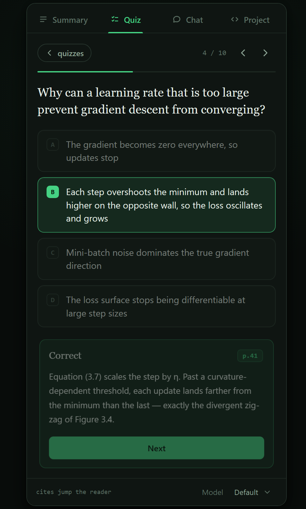
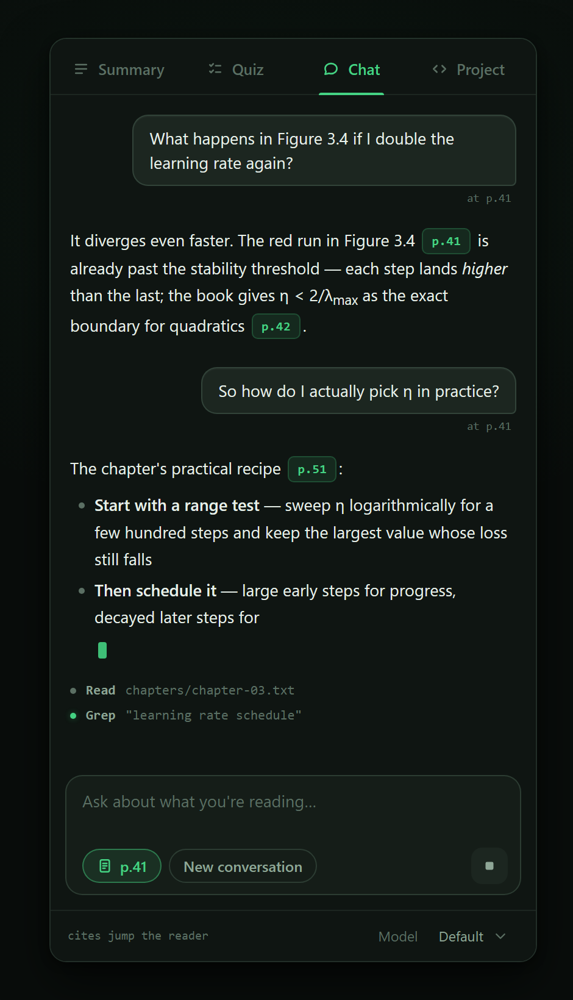
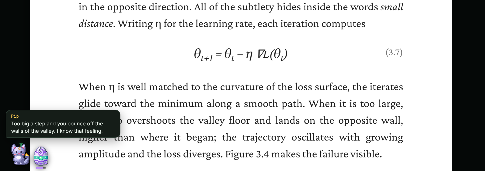
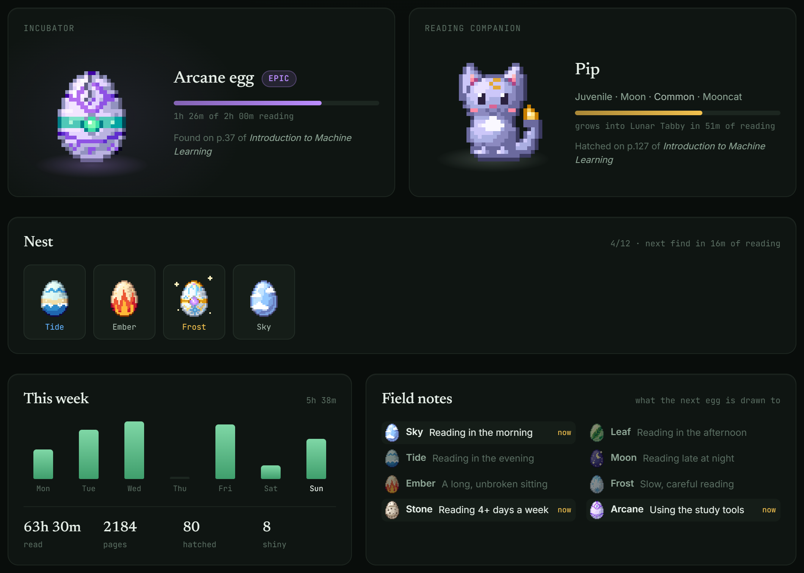
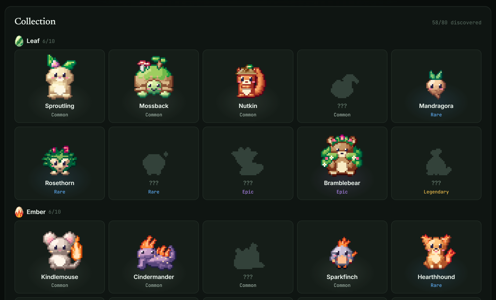
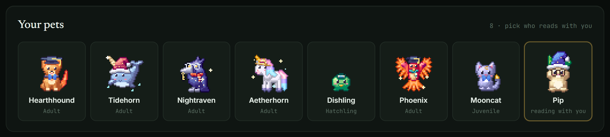
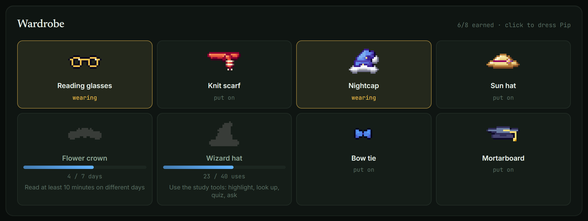
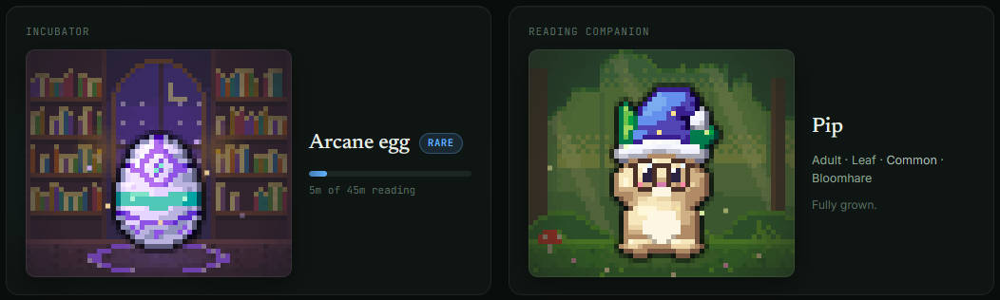
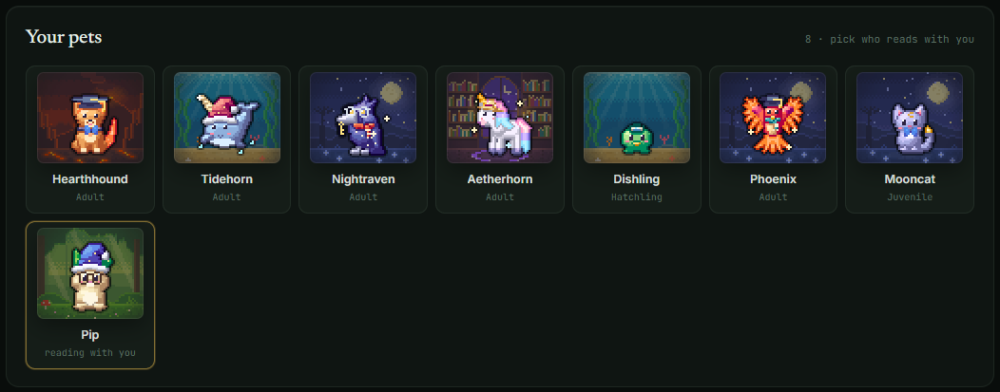

<div align="center">


# TutorAI

**A desktop PDF reader with a tutor inside.**

Open a textbook. Ask it anything. Every answer cites the page.

[](https://tauri.app)
[](https://react.dev)
[](https://www.rust-lang.org)
[](https://mozilla.github.io/pdf.js/)
[](https://claude.com/claude-code)


[Features](#features) · [How it works](#how-it-works) · [Getting started](#getting-started) · [Project layout](#project-layout) · [Troubleshooting](#troubleshooting)

<br/>


<sub><i>Reading with the tutor open — every claim in the summary carries a</i> <code>p.N</code> <i>chip that jumps the reader to the evidence.</i></sub>

</div>

---

TutorAI turns any PDF — a textbook, a paper, a technical report — into something
you can study *with*, not just read. It summarizes chapters, quizzes you on what
you've read, answers questions grounded in the exact page you're looking at, and
can even build a runnable coding project out of the material. Every answer cites
its sources: click a `p.12` chip anywhere and the reader jumps to that page.

All of it runs through the **[Claude Code](https://claude.com/claude-code) CLI
already installed on your machine**. There are no API keys to manage, no
accounts to create, and no backend service: if `claude` works in your terminal,
TutorAI works. Your documents are parsed locally and cached on disk; the only
thing that leaves your machine is what the CLI itself sends when you ask the
tutor something.

---

## Features

### The reader

- **Fast on big books.** Pages render through a virtualized pdf.js viewer —
  only what's near the viewport is rasterized — so thousand-page PDFs scroll
  smoothly.
- **A real library.** Every book gets a rendered cover, a reading-progress bar,
  and a remembered position. Close the app mid-chapter; reopen on the same page.
- **Tabs.** Open several documents at once and drag their tabs to reorder;
  each document lives in exactly one tab, so opening it again just focuses it.
  Every tab keeps its own reading position, the strip stays visible on the
  library screen so open books remain one click away, and the whole set —
  including which tab was active — comes back on relaunch.
- **Chapter outline.** The sidebar shows the document's bookmark outline. If a
  PDF has none, one click asks the AI to reconstruct chapters from the text.
- **Precise text selection** with a one-click **Explain** / **Ask** popover on
  whatever you highlight.
- **Snip a figure.** Drag a box around a diagram, chart, or equation right on
  the page and it lands in Chat as an image — the tutor sees exactly what you
  circled, not just the surrounding text.
- Resizable, smoothly sliding panels; an editable page indicator; fit-width and
  manual zoom.

### Marking up

A full annotation suite, built for studying — and deliberately invisible until
you reach for it:

- **Select text → mark it.** The selection popover leads with five highlighter
  swatches (color-coding is a real study system), underline, strikethrough,
  and *add note* — one gesture from intent to mark. The AI's Explain/Ask
  actions live in the same pill.
- **The markup rail** (the pen button in the toolbar, or `M`) summons a slim
  floating pill of canvas tools: select, drag-highlighter, pen, text box,
  sticky note, and a stroke eraser, plus a pen tray with three remembered
  presets (including a marker that multiplies over the page like a real
  one). Tools are sticky — mark as many passages as you like, `Esc` steps out.
- **Sticky notes and free text.** Notes collapse to a small colored fold on
  the page (the AI companion's marks stay out in the margin — you'll never
  confuse whose note is whose) and expand into an editing card; free text is
  typed straight onto the page in ink colors, movable and resizable.
- **Marks tab.** The sidebar's second tab lists every annotation — quote
  excerpts, note previews, page numbers — filterable by color and kind;
  click any card and the reader jumps there with a locate pulse.
- **Undo/redo everything** (`Ctrl+Z` / `Ctrl+Y`), per document, gesture by
  gesture.
- **Your PDF is never modified.** Annotations live in a plain-JSON sidecar in
  the document's cache dir — which also means the tutor can read your
  highlights and notes. Marks track the page through every zoom, reflow, and
  restart.

### The tutor

Four tabs live in the study panel, all scoped to either the whole document or a
single chapter:

| Tab | What it does |
| --- | --- |
| **Summary** | Page-cited study summaries — key concepts, definitions, takeaways. |
| **Quiz** | Interactive multiple-choice quizzes (length and difficulty are yours to pick), graded as you go, with explanations and a citation for every question. Progress is saved; skip around freely and resume any time. |
| **Chat** | Ask anything about the document, or snip a figure straight into the conversation. With *reading context* on, the tutor sees the page you're currently on and its neighbors — "why does this equation hold?" just works. The tutor can see figures and diagrams too, not just extracted text. Conversations are multi-turn. |
| **Project** | An agentic Claude builds a runnable coding project from the material into an isolated workspace folder, verifies it runs, and maps the code back to the pages it teaches. |

Citations are everywhere by design: every claim the tutor makes about the
document carries a `p.N` chip that jumps the reader to the evidence.

### The companion

An opt-in fifth presence (the margin-note toggle in the toolbar): while you
read, the companion analyzes the pages you're on in the background and leaves
**margin notes** — quiet green marks beside the page that expand into cards.
It only writes what the document *doesn't* say: real-world examples, gotchas
practitioners actually hit, missing context, and web-verified "the world has
moved on" updates with source links. Most page spans yield nothing — silence
is by design. Every analyzed span is cached in the document's artifacts, so a
span never spends your quota twice; a note can be dismissed or handed to the
chat tab to dig deeper.

With a reading pet around (below), the companion's runs also give your pet
the occasional one-line aside about the page you're on. The same call does
both, so it costs nothing extra.

<p align="center">
  
  
</p>
<p align="center">
  <sub><i>Left: quizzes grade as you go and cite the page behind every answer. Right: chat streams in live — including which chapter files the tutor is reading.</i></sub>
</p>

### Reading pets

An optional hatchery that rewards actual reading:

- **Eggs warm while you read.** Only real reading counts: time on the page
  with recent scrolls, page turns or selections. It pauses when you step away.
  Every 25 minutes of reading turns up a new egg. Finishing a chapter or a
  whole book finds a rarer one. How you read decides what hatches: mornings
  draw Sky eggs, late nights Moon, long sittings Ember, slow careful reading
  Frost, and the study tools Arcane. The `?` beside each egg type explains it.
- **80 creatures to collect.** There are 10 per element across 8 elements
  (leaf, ember, tide, stone, sky, frost, moon, arcane). Each has four tiers
  from common to legendary, three growth stages, and a rare shiny variant.
  All of them are pixel art drawn by code (`src/lib/hatchery/`).
- **A companion in the corner.** Your chosen pet sits by the page. It sleeps
  when you stop reading, hops when you come back, and cheers finished
  chapters and study habits (highlighting, quizzing, lookups). With the
  reading companion on, it also cracks a joke now and then about what you're
  reading.
- **A wardrobe earned by reading.** Eight accessories: reading glasses, a
  knit scarf, a nightcap, a sun hat, a flower crown, a wizard hat, a bow tie
  and a mortarboard. Each one comes from a habit, like slow careful reading,
  late nights, days you came back, finished chapters or a finished book. Any
  pet can wear any accessory you've earned, and each one is fitted by hand to
  all 80 creatures at every growth stage.
- **Habitats.** Every pet and egg lives in a pixel-art scene of its element:
  a sunlit glade, ember crags, kelp shallows, a crystal cavern, a cloud sea,
  aurora pines, a moonlit meadow or a night library. Snow, embers, bubbles
  or fireflies drift through each one. Discovering a creature of an element
  unlocks its habitat, and you can move your companion to any unlocked one.
- **Out of the way when you want it to be.** Hide the pet from the reader and
  keep hatching, or turn reading pets off entirely. Off means off: no
  tracking, no tab. Your collection is kept for when you turn it back on.

<p align="center">
  
  <sub><i>Pip reads along and, with the companion on, has opinions about step sizes.</i></sub>
</p>
<p align="center">
  
  
</p>
<p align="center">
  <sub><i>Left: the hatchery, with the egg you're warming, your companion, the nest and your reading week. Right: the collection fills in as you hatch; undiscovered species show as silhouettes.</i></sub>
</p>

<p align="center">
  
  
  <sub><i>Accessories are earned by how you read and fitted by hand to every creature. Locked ones show what earns them.</i></sub>
</p>
<p align="center">
  
  
  <sub><i>Each element has its own habitat. Pets stand in theirs, or in any you've unlocked.</i></sub>
</p>

---

## How it works

```
┌──────────────────────────────────────────────────────────────┐
│  React + pdf.js (Tauri webview)                              │
│    · virtualized rendering, selection, outline               │
│    · extraction: per-page text with [[PAGE n]] markers +     │
│      figure pages rendered to JPEG; chapters from the        │
│      outline (or AI-reconstructed)                           │
│    · cached under <app-data>/docs/<content-hash>/            │
└───────────────┬──────────────────────────────────────────────┘
                │ Tauri IPC (typed commands, streamed events)
┌───────────────▼──────────────────────────────────────────────┐
│  Rust (Tauri)                                                │
│    · spawns `claude -p --output-format=stream-json` per job  │
│    · streams NDJSON events (text deltas, tool activity)      │
│      back to the UI; `--resume` powers multi-turn chat       │
│    · document jobs run read-only over the cached chapter     │
│      files; project jobs run agentic, cwd-pinned to an       │
│      isolated workspace folder                               │
└──────────────────────────────────────────────────────────────┘
```

A few properties fall out of this design:

- **No API keys, ever.** The Claude CLI handles authentication; TutorAI never
  sees or stores a credential.
- **Extraction happens once.** On first open, the document's text is extracted
  per page and split into chapter files keyed by the file's content hash.
  Every AI feature reads from that cache instead of re-parsing the PDF.
- **Least privilege per job.** Summaries, quizzes, and chat run with read-only
  file access to the document cache. Only project generation gets write access,
  and only inside its own workspace directory.
- **Everything streams.** Long jobs show live progress — including which files
  the agent is reading — and can be cancelled mid-flight.

---

## Getting started

### Requirements

- **[Claude Code](https://claude.com/claude-code)** installed and signed in
  (`claude` must be on your `PATH`)
- **Node.js** 20+ and **Rust** (stable) — standard
  [Tauri 2 prerequisites](https://tauri.app/start/prerequisites/) for your OS
- Windows, macOS, or Linux with WebView2/WebKit

### Run it

```sh
npm install
npm run tauri dev      # develop, with hot reload
npm run tauri build    # produce a signed installer / bundle
```

Open a PDF via the button or just drop one anywhere onto the window.

---

## Project layout

```
src/                      React frontend
  lib/                    types, IPC wrappers, pdf.js extraction,
                          prompt builders, session state
  components/             Reader, Home/library, toolbar, and the
                          Summary / Quiz / Chat / Project tabs
  lib/hatchery/           reading pets: game rules, reading tracker,
                          pixel-art rasterizer, the 80 species
                          (art guide in ART.md), accessories and
                          their per-species fits (fit/), habitat
                          scenes (scenes.ts)
  components/hatchery/    hatchery screen, hatch reveal, reader companion
src-tauri/src/
  claude.rs               headless CLI runner: spawn, NDJSON→event
                          translation, cancellation
  jobs.rs                 in-flight job registry
  store.rs                library index, per-document cache and the
                          hatchery save on disk
scripts/
  render-icon.mjs         rasterizes the SVG app-icon design source
                          (regenerate everything with `npm run icon`)
  sprite-sheet.ts         renders every egg and pet to a PNG contact
                          sheet for art review (`node scripts/sprite-sheet.ts`)
  wardrobe-sheet.ts       renders each species wearing every accessory,
                          for fitting them (`node scripts/wardrobe-sheet.ts`)
  scene-sheet.ts          renders every habitat with creatures standing in
                          it (`node scripts/scene-sheet.ts`)
```

### Design

The UI is a single dark theme ("night study"): a green-cast ink palette around
a near-black page well, with one spring-green accent reserved for AI presence
and the places it can take you. Type is set in three voices — Newsreader for
the reading world, Inter for controls, JetBrains Mono for the instrument layer
(page numbers, citations, activity). The app icon is the **Bookmark-T** — a
"T" for Tutor whose stem is a ribbon bookmark — and the same glyph marks AI
presence throughout the interface. Its design source lives at
`src-tauri/icons/icon.svg`; after editing it, run `npm run icon` and touch
`src-tauri/build.rs` so the next build re-embeds the Windows icon resource.

---

## Troubleshooting

- **"claude not found" / jobs fail instantly** — make sure `claude` runs in a
  fresh terminal. TutorAI inherits your login environment; if the CLI was just
  installed, restart the app.
- **A PDF opens but AI tabs stay on "Preparing"** — extraction of very large
  documents takes a moment on first open (progress is shown bottom-center of
  the reader). It only happens once per document.
- **Chapters look wrong** — PDFs without a bookmark outline fall back to a
  single whole-document chapter; use *Detect chapters with AI* in the sidebar.
